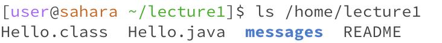

# Erich Then - CSE15l Lab Report 1
# CD COMMAND  

## No argument command and output: 
**No output, command:[user@sahara ~]$ cd**  
**Working Directory:** /home
**Explanation:** I believe the output is blank because cd is used to move between directories,
but it needs the argument of where to go to. 
**Error?** I wouldn't call it an error because it is blank. It moved back to the home directory.

## Directory as an argument command and output: 
**No output, command: [user@sahara ~]$ cd lecture1**  
**Working Directory:** /home/lecture1
**Explanation:** This output or lack thereof means that the command worked and the one visible change
was the prompt now containing lecture1: [user@sahara ~/lecture1]$
**Error?** Not an error

## File as an argument command and output

**Working Directory:** /home/lecture1
**Explanation:** I believe this is because the cd command is
looking for a directory to switch to, and not a file. 
**Error?** This is an argument error, we gave it the wrong type of argument, a path to a file instead of a directory. 

# LS COMMAND
## No argument command and output  
  
**Working Directory:** /home/lecture1
**Explanation:** This output lists the files and folders in the current working directory. 
**Error?** No error

## Directory as an argument command and output  

**Working Directory:** /home/lecture1
**Explanation:** 
**Error?**

## File as an argument command and output
**Working Directory:** 
**Explanation:** 
**Error?**

# CAT COMMAND
## No argument command and output
**Working Directory:** 
**Explanation:** 
**Error?**

## Directory as an argument command and output
**Working Directory:** 
**Explanation:** 
**Error?**

## File as an argument command and output
**Working Directory:** 
**Explanation:** 
**Error?**
