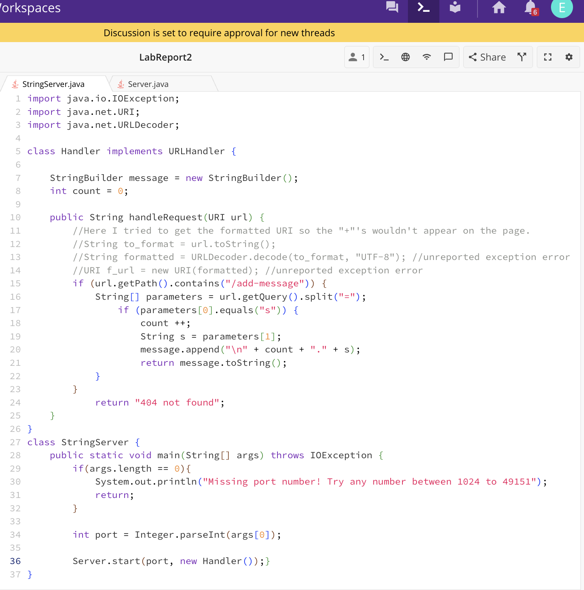
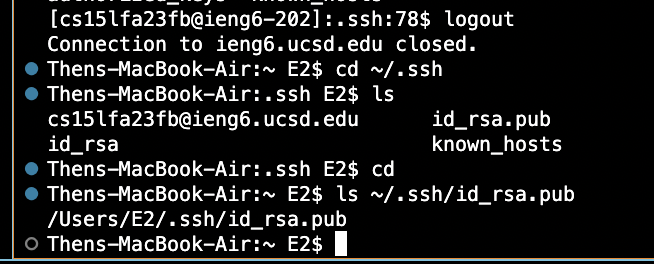
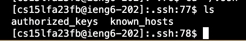
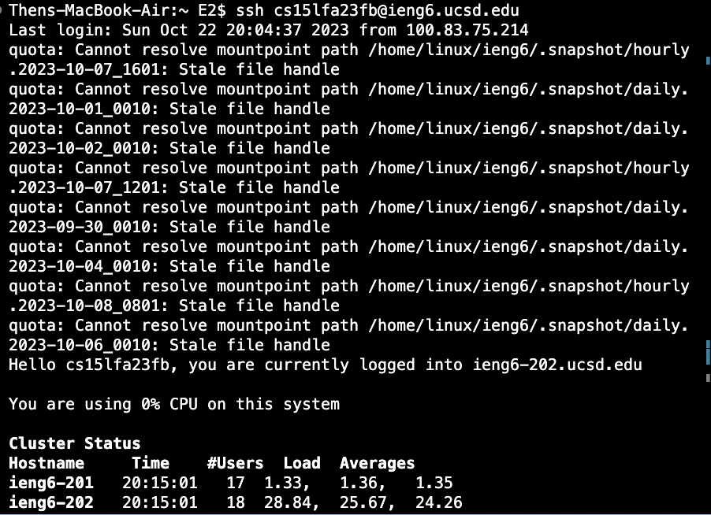

# Erich Then - Lab Report 2  

  # Part 1  
  
  ## StringServer.java Code
    

  ## /add-message?s=Hello  
    
  **Which methods in your code are called?**  
  Assuming the server is already set up as it is here, the methods that are called 
  in this code when this request is run are the 
  *handleRequest, getPath().contains(), getQuery().split(), parameters[0].equals(), 
  message.append()*.  
  **What are the relevant arguments to those methods, and the values of any 
  relevant fields of the class?**  
  *handleRequest* takes the argument of a URI: "url", *getPath* is called on this 
  url, and the argument *contains()* takes is "/add-message", to check if it is 
  there in the url. We also call *getQuery()* on the url, using the *split* method 
  with the argument "=", so we can look before and after (parameter[0] and 
  parameter[1]) this argument. *.equals()* is called with the argument "s" : 
  checking if there is "s" before the equals (parameter[0]). If so, the relevant 
  field of my count variable is increased, and the *append()* method is called on 
  my StringBuilder to correctly format and add the message. 
  **How do the values of any relevant fields of the class change from this specific 
  request? If no values got changed, explain why.**  
  From this specific request, the field "count" is changed by an increment of 1. My 
  StringBuilder field also changes for this request, as a result of appending ("\n" 
  count + "." + s); as well as Parameter[1] now storing "Hello".  

  ## /add-message?s=How are you  
    
  **Which methods in your code are called?**  
  Again, if the server is already set up as it is here, the methods that are called 
  in this code when this request is run are the 
  *handleRequest, getPath().contains(), getQuery().split(), parameters[0].equals(), 
  message.append()*. I believe the same methods are called for this request.  
  **What are the relevant arguments to those methods, and the values of any 
  relevant fields of the class?**  
  *handleRequest* takes the argument of a URI: "url". The value of this field is the URI from the Server.java. *getPath* is called on this 
  url, and the argument *contains()* takes is "/add-message", to check if it is 
  there in the url. We also call *getQuery()* on the url, using the *split* method 
  with the argument "=", so we can look before and after (parameter[0] and 
  parameter[1]) this argument. *.equals()* is called with the argument "s" : 
  checking if there is "s" before the equals (parameter[0]). If so, the relevant 
  field of my count variable is increased, and the *append()* method is called on 
  my StringBuilder to correctly format and add the message, making the value of 
  that field the string that is returned to the page: ("\n" + 2 + "." + "How are you"), with count having the value of 2.  
  **How do the values of any relevant fields of the class change from this specific 
  request? If no values got changed, explain why.**  
  With this new request, the URI url argument for our *handleRequest* method is 
  changed and contains the new request. The Parameters field is also changed to 
  ["s", "How are you"], and the count field is incremented once more to have a 
  value of 2. Thus, my StingBuilder field is changed from the output of the last 
  request to that output plus the new argument in the .append(). It goes from 
  "1.Hello" to "1.Hello  
  2. How+are+you". 

  # Part 2  

  ## Path to the Private Key  
  
  
  ## Path to the Public Key  
  
  

  ## Trying to get Public Key within ieng6  
  The public key path should be within my ieng6 account, but I couldn't get the 
  files into the /.ssh directory on my course account. Below is my ls command in   that directory  
    

  ## Terminal Interaction Without Password  
    

  # Part 3
  ## What I learned  
  **Something I learned that I didn't know before was the concept of logging in 
  to a remote course-specific account through my terminal. I learned we can do 
  this using the ssh command, and I also had no idea that we could bypass the 
  password entry.**
  

  
  
  
  
 
    
  
 
    
  
