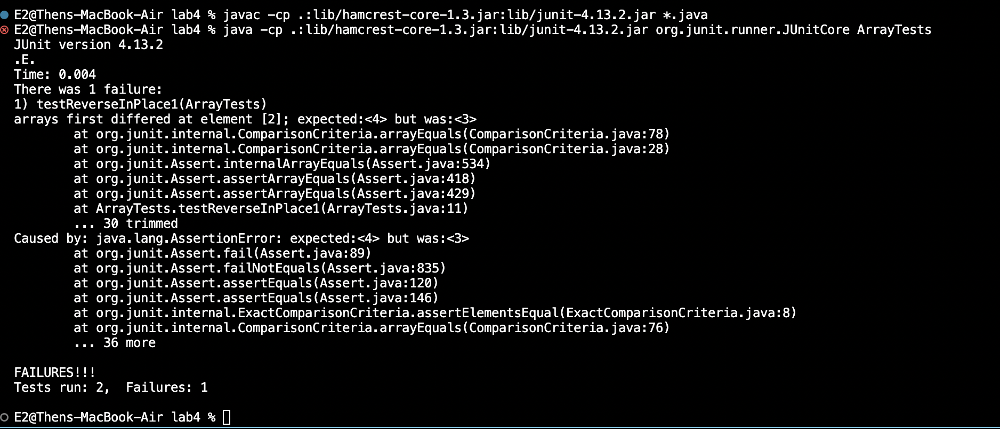

# Erich Then - Lab Report 3  

## Part 1: Bugs

### Failure inducing input for reverseInPlace method:  

```
{
 @Test
  public void testReverseInPlace1() {
    int[] input = {4, 4, 3};
    int[] expected = {3, 4, 4};
    ArrayExamples.reverseInPlace(input);
    assertArrayEquals(expected, input);
  }
}
```

### Non-failure inducing input for reverseInPlace method: 

```
{
  @Test
  public void testReverseInPlace2() {
    int[] input = {1, 3, 1};
    int[] expected = {1, 3, 1};
    ArrayExamples.reverseInPlace(input);
    assertArrayEquals(expected, input);
    
  }
}
```

### Output of running these two tests:  

  

### Addressing the issue  

#### Method before debugging:  

```
{
static void reverseInPlace(int[] arr) {
    for(int i = 0; i < arr.length; i += 1) {
       arr[i] = arr[arr.length - i - 1];
    }
  }
}
```

#### Method after debugging: 

```
{
static void reverseInPlace(int[] arr) {

  for(int i = 0; i < arr.length / 2; i += 1) {
        
        int temp = arr[i];
        arr[i] = arr[arr.length - i - 1];
        arr[arr.length - i - 1] = temp;
    }
 }
}
```
#### The issue with this method lies in the swapping step. The one-step line in the for loop will only swap the first half of the values,  by the time we iterate past half of the array, the loop oversteps and continues to swap, thus giving an incorrect reversal. To fix this, we store arr[i] into a temporary variable before we do the swap step. Following this, we reassign our temporary variable to the same index we assigned to arr[i]. Because we store the element at the index of our array, do the step, and then assign the temporary variable to the opposite index, this will properly swap the array, assuming we only iterate half of it. Consequently, we then fix the iteration to only go up to arr.length/2 so the last values won't get overwritten with the wrong first values. 

## Part 2: Researching the grep command  

### Option 1: A case-insensitive search  

```
{
E2@Thens-MacBook-Air biomed % grep -i fEnTaNyL cc3.txt
            Fentanyl and morphine
            The effect on the EEG of intravenous fentanyl in
            consistent with anesthesia. Lower doses of fentanyl
            theta bands. In the cat, very high levels of fentanyl,
            morphine is similar to that of fentanyl, and resembles
        midazolam (Figs 4 and 5), lorazepam (Fig 6), and fentanyl
E2@Thens-MacBook-Air biomed % 
}
```
#### In this example, I call the grep command which searches the file for a sequence of characters, outputting the lines of the file that contain the sequence. In this command, I search for the sequence fEnTaNyL in biomed/cc3.txt. Normal use of grep wouldn't have returned any lines with this sequence call, however, because I used the -i option, it will output the lines that have fentanyl in them, regardless of the case. This is useful because there are times when certain sequences are only different because of the casing, but if you want all of the lines with this sequence disregarding the casing, this command is helpful.  
```
{
Thens-MacBook-Air:911report E2$ grep -i "omari" chapter-1.txt
    For those heading to an airport, weather conditions could not have been better for a safe and pleasant journey. Among the travelers were Mohamed Atta and Abdul Aziz al Omari, who arrived at the airport in Portland, Maine.
    Boston: American 11 and United 175. Atta and Omari boarded a 6:00 A.M. flight from Portland to Boston's Logan International Airport.
    Atta and Omari arrived in Boston at 6:45. Seven minutes later, Atta apparently took a call from Marwan al Shehhi, a longtime colleague who was at another terminal at Logan Airport. They spoke for three minutes.
    Between 6:45 and 7:40, Atta and Omari, along with Satam al Suqami, Wail al Shehri, and Waleed al Shehri, checked in and boarded American Airlines Flight 11, bound for Los Angeles. The flight was scheduled to depart at 7:45.
    While Atta had been selected by CAPPS in Portland, three members of his hijacking team-Suqami, Wail al Shehri, and Waleed al Shehri-were selected in Boston. Their selection affected only the handling of their checked bags, not their screening at the checkpoint. All five men cleared the checkpoint and made their way to the gate for American 11. Atta, Omari, and Suqami took their seats in business class (seats 8D, 8G, and 10B, respectively). The Shehri brothers had adjacent seats in row 2 (Wail in 2A, Waleed in 2B), in the firstclass cabin. They boarded American 11 between 7:31 and 7:40. The aircraft pushed back from the gate at 7:40.
    At the same time or shortly thereafter, Atta-the only terrorist on board trained to fly a jet-would have moved to the cockpit from his business-class seat, possibly accompanied by Omari. As this was happening, passenger Daniel Lewin, who was seated in the row just behind Atta and Omari, was stabbed by one of the hijackers-probably Satam al Suqami, who was seated directly behind Lewin. Lewin had served four years as an officer in the Israeli military. He may have made an attempt to stop the hijackers in front of him, not realizing that another was sitting behind him.
}
```
#### Similarly, in this example, I want to find the lines that contain the sequence "omari" and such is the output. This is especially useful for finding the names of people in a file without having to worry about the capitalization of them.  

### Option 2: Checking for the entire word, avoiding substrings  

```
{
Thens-MacBook-Air:911report E2$ grep -w "Atta" chapter-1.txt
    For those heading to an airport, weather conditions could not have been better for a safe and pleasant journey. Among the travelers were Mohamed Atta and Abdul Aziz al Omari, who arrived at the airport in Portland, Maine.
    Boston: American 11 and United 175. Atta and Omari boarded a 6:00 A.M. flight from Portland to Boston's Logan International Airport.
    When he checked in for his flight to Boston, Atta was selected by a computerized prescreening system known as CAPPS (Computer Assisted Passenger Prescreening System), created to identify passengers who should be subject to special security measures. Under security rules in place at the time, the only consequence of Atta's selection by CAPPS was that his checked bags were held off the plane until it was confirmed that he had boarded the aircraft. This did not hinder Atta's plans.
    Atta and Omari arrived in Boston at 6:45. Seven minutes later, Atta apparently took a call from Marwan al Shehhi, a longtime colleague who was at another terminal at Logan Airport. They spoke for three minutes.
    Between 6:45 and 7:40, Atta and Omari, along with Satam al Suqami, Wail al Shehri, and Waleed al Shehri, checked in and boarded American Airlines Flight 11, bound for Los Angeles. The flight was scheduled to depart at 7:45.
    The security checkpoints through which passengers, including Atta and his colleagues, gained access to the American 11 gate were operated by Globe Security under a contract with American Airlines. In a different terminal, the single checkpoint through which passengers for United 175 passed was controlled by United Airlines, which had contracted with Huntleigh USA to perform the screening.
    While Atta had been selected by CAPPS in Portland, three members of his hijacking team-Suqami, Wail al Shehri, and Waleed al Shehri-were selected in Boston. Their selection affected only the handling of their checked bags, not their screening at the checkpoint. All five men cleared the checkpoint and made their way to the gate for American 11. Atta, Omari, and Suqami took their seats in business class (seats 8D, 8G, and 10B, respectively). The Shehri brothers had adjacent seats in row 2 (Wail in 2A, Waleed in 2B), in the firstclass cabin. They boarded American 11 between 7:31 and 7:40. The aircraft pushed back from the gate at 7:40.
    At the same time or shortly thereafter, Atta-the only terrorist on board trained to fly a jet-would have moved to the cockpit from his business-class seat, possibly accompanied by Omari. As this was happening, passenger Daniel Lewin, who was seated in the row just behind Atta and Omari, was stabbed by one of the hijackers-probably Satam al Suqami, who was seated directly behind Lewin. Lewin had served four years as an officer in the Israeli military. He may have made an attempt to stop the hijackers in front of him, not realizing that another was sitting behind him.
    The hijackers attacked sometime between 8:42 and 8:46. They used knives (as reported by two passengers and a flight attendant), Mace (reported by one passenger), and the threat of a bomb (reported by the same passenger). They stabbed members of the flight crew (reported by a flight attendant and one passenger). Both pilots had been killed (reported by one flight attendant). The eyewitness accounts came from calls made from the rear of the plane, from passengers originally seated further forward in the cabin, a sign that passengers and perhaps crew had been moved to the back of the aircraft. Given similarities to American 11 in hijacker seating and in eyewitness reports of tactics and weapons, as well as the contact between the presumed team leaders, Atta and Shehhi, we believe the tactics were similar on both flights.
    While it apparently was not heard by the passengers, this announcement, like those on Flight 11 and Flight 77, was intended to deceive them. Jarrah, like Atta earlier, may have inadvertently broadcast the message because he did not know how to operate the radio and the intercom. To our knowledge none of them had ever flown an actual airliner before.
Thens-MacBook-Air:911report E2$ 
}
```
#### The use of grep -w also prints the lines that match a certain sequence. However, this option will only print the lines where the sequence is a stand-alone word. This is extremely helpful in my above example because a normal grep call on "atta" will return all the lines with that sequence, even if it is a substring of another word, like "attack", both being common in this text file.  
```
{
Thens-MacBook-Air:911report E2$ grep -w "Jordan" chapter-6.txt
to attack Jewish and American targets in Jordan.
plotters. After Abu Hoshar's release, Hijazi shuttled between Boston and  Jordan
well as Jordan; with Abu Zubaydah's assistance, Abu Hoshar sent these recruits to
Jordan into Israel, and two Christian holy sites, at a time when all these locations
committing himself to do anything Bin Ladin ordered. He then departed for Jordan and On December 4, as news came in about the discoveries in Jordan, National Security
that provided intelligence via liaison. On occasion, as in Jordan in December 1999,
}
```
#### Here, I want to find the lines that contain the country Jordan. This is helpful because I do not need to know the lines that contain "Jordanian", which Jordan is a substring of. As you can see, the output gives me the lines with just Jordan in them.  

### Option 3: Showing the line number of lines that contain the sequence    

```
{
Thens-MacBook-Air:Alcohol_Problems E2$ grep -n "Daniel Pollock" DraftRecom-PDF.txt
11:conference, he and Daniel Pollock drafted recommendations for the
122:Daniel Pollock added that the message of the recommendations
}
```
#### This use of the grep command will tell us the line number of the matching lines before it gives us the line. This is extremely helpful because one can now find where the lines are, instead of just being shown the lines.  
```
{
Thens-MacBook-Air:Alcohol_Problems E2$ grep -n "novel" Session4-PDF.txt
1372:lead to novel interventions.
}
```
#### Here, I am using the grep command with the -n option so I know which line the word "novel" appears in the file. As we can see, it is only found on the very last line of the file, line 1372. As one can imagine, it would take a while to find without using grep -n.  

### Option 4: Counting the lines with the matching sequence  

```
{
Thens-MacBook-Air:911report E2$ grep -c -i  "al Qaeda" chapter-13.4.txt
86
}
```
#### In this example, I call the grep command with this last option, -c. This will count the number of lines that contain "al Qaeda" in the fourth file of chapter 14 in the 911report directory. Because I am combining the count with -i, which as I stated above disregards the cases of the characters, al Qaeda and Al Qaeda are both counted. This is helpful if you want to know the frequency of the lines that contain said sequence.  
```
{
Thens-MacBook-Air:Media E2$ grep -c -w "a" A_helping_hand.txt
32
}
```
#### This command will count the amount of times "a" appears in the text. Since I am combining it with the -w option above, I am looking for the frequency of lines that contain "a" as a word by itself. Using this command shows me that 32 lines contain a lowercase, independent "a" in this file. This is helpful to use once again if you want to get an idea of how frequently the sequence appears in the file.  

## Source used as a reference for all options: [Geeks for Geeks - grep command in Unix/Linux](https://www.geeksforgeeks.org/grep-command-in-unixlinux/)


