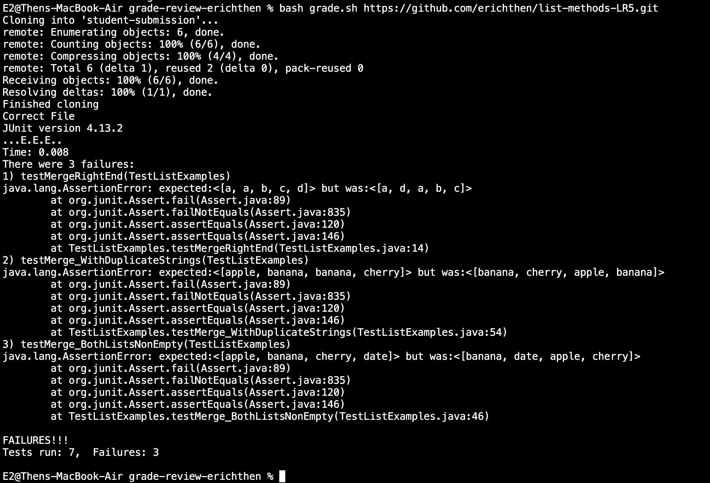
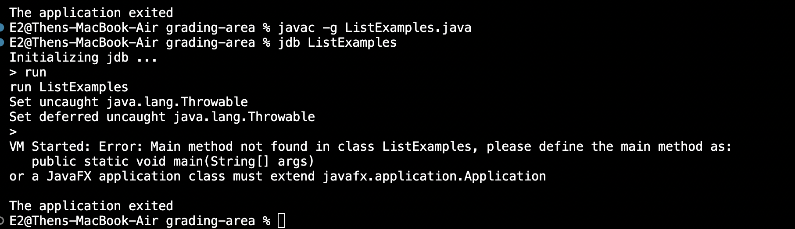
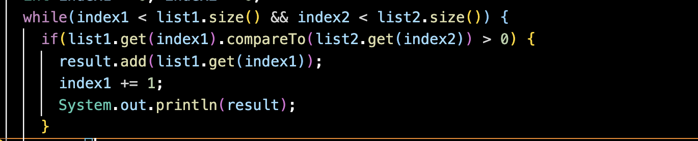
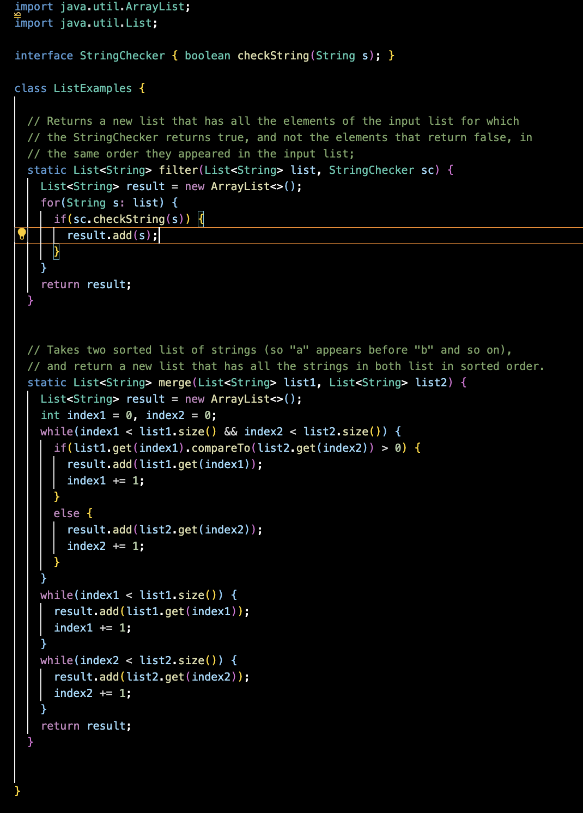
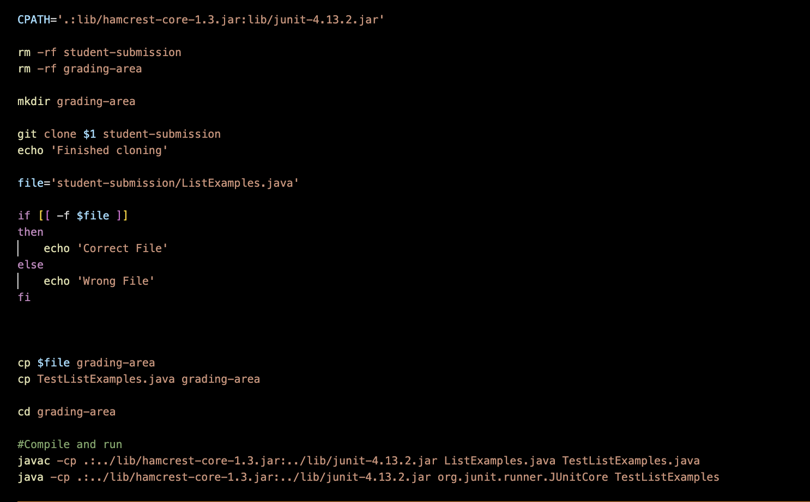

# Erich Then - Lab Report 5  

## Part 1
### Student Post

**Sample Student:** Hello, Sample TA. I was working on the implementation for the merge method in my ListExamples.java file. This takes two sorted lists of strings (so "a" appears before "b" and so on), and returns a new list that has all the strings in both lists in sorted order. I use my bash script to assess my progress and check the correctness of this method. This simple script clones the input repository link and extracts the file. It checks if the file is there and valid, and then proceeds to copy the path of the test file and the student file, before running tests on the merge method found in TestListExamples.java, outputting the status of the cloning, the file, and the test output. Below is the output of my script when passed the link to my repository.    
  
Judging from the output of my test script above, I am guessing that the bug revolves around my while loop in the merge method. I believe that the failure-inducing input has to do with my while loop that controls the merging of the two lists. The output indicates that index 2 of the actual output is the index 0 of the expected output, and the 0 index of the actual output seems to correspond correctly to the 1st index of the expected output. Other than that, I cannot see any more symptoms or patterns that properly diagnose this bug. Is there any chance I can get some help/hints on debugging this? Thank you.  

**Sample TA:** Hello, Sample Student, it would be helpful to see your merge method. However, if you are confident in the merge method, you can try using jdb to diagnose the issue. For example, initialize jdb after compiling your file with javac -g <filename>, and try stopping after your while loop in your merge method. Here, you can print the value of result, and use it to get a better understanding of your bug. If jdb is not cooperating, a leading question I have is what is a built in java method you put in your file to see what result is after the method?  

**Sample Student:** I see,well at first I tried debugging this through jdb, which did not work because I was getting an interesting error saying the main method in my class ListExamples was not found. Below is me trying to use jdb to solve this issue:  
 
Regarding your question, I don't exactly know, but I can try using the built-in System.out.println() method on my result after the first while loop in the merge method. Below is me inputting this print statement in a place I believe will be useful to find out what the bug is.  
  
I can now see in the output that after this initial while loop, result is not what it is supposed to be. Therefore, I can deduce the bug to be in the first while loop of this merge method. Because it is compiling correctly, just in the wrong order, I referenced the documentation of the CompareTo method in java. I found out that this compareTo is supposed to check if list1.get(index1) is SMALLER than list2.get(index2). The compareTo method returns above zero if greater, 0 if equal, and below zero if smaller. Therefore, the bug is an incorrect use of compareTo. Instead of if(list1.get(index1).compareTo(list2.get(index2)) > 0), I need to change it to if(list1.get(index1).compareTo(list2.get(index2)) < 0).  

### File and Directory structure needed:  
My user directory, and the directory of the forked repository, and the created grading-area directory which contains the ListExamples.java file and the TestListExamples.java file.  
/Users/E2/grade-review-erichthen/grading-area
ls on this directory: IsMoon.class            ListExamples.class      ListExamples.java       StringChecker.class     TestListExamples.class  TestListExamples.java
Additionally, the bash script is needed in the working directory, which is in the parent directory of grade-review-erichthen: my repository that checks submissions.  

### Contents of each file before fixing the bug: 
  
  

### Command lines run to trigger the bug:  
1. cd grade-review-erichthen //This adds the directory of the relevant repository that contains my grading script and the file with the tests.
2. bash grade.sh https://github.com/erichthen/list-methods-LR5.git //The second and last command used to trigger this bug was a run on my bash script.

### Description of what to edit to fix the bug:
Firstly, cd the grading-area directory created by the script which contains the file we need to edit: ListExamples.java. 
Then, run vim ListExamples.java to open the vim editor on this file. 
Keys Pressed from here to fix bug: `:28` , `$`, `h`, `h`, `h`, `h`, `r`, `<`, `wq`.  
This goes to the line of the bug, goes to the end of the line of the bug, moves the cursor to the left 4 times to hover ">", replaces ">" with "<", and saves the file while exiting the editor. The bug is now fixed.  

## Part 2

### In the second half of my lab experience this quarter, I learned many things, but the most notable and applicable being both making files and directories from the command line and editing files from the command line. The really helpful command was mkdir - p, which allows me to make and organize nested directories from the terminal. This is now how I make a folder or file on my Mackbook, I only use the terminal. Editing with vim was something I had not heard of before the second half of the class, but now I really enjoy the simplicity and usefulness of editing something directly from the terminal/command line. Another small but remarkably helpful thing I learned from my tutor was to use the arrow keys to access previously called commands. 

