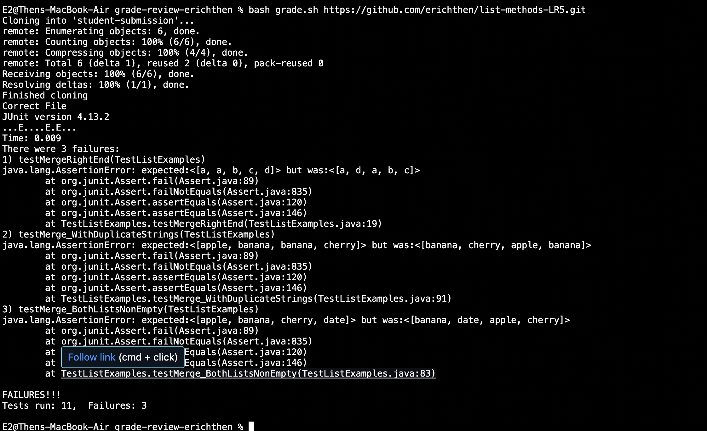

## Erich Then - Lab Report 5  

### Student Post

**Sample Student:** Hello, Sample TA. I was working on the implementation for the merge method in my ListExamples.java file. This takes two sorted lists of strings (so "a" appears before "b" and so on), and returns a new list that has all the strings in both lists in sorted order. I use my bash script to assess my progress. This simple script clones the input repository link and extracts the file. It checks if the file is there and valid, and then proceeds to copy the path of the test file and the student file, before running tests on the merge method found in TestListExamples.java. 
  
Judging from the output of my test script above, I am guessing that the bug revolves around my merged method. I believe that the failure-inducing input has to do with my while loop that controls the merging of the two lists. The output indicates that the index 2 of the actual output is the index 0 of the expected output, and the 0 index of the actual output seems to correspond correctly to the 1st index of the expected ouput. Other than that, I cannot see any more symptoms or patterns that properly diagnose this bug. Is there any chance I can get some help/hints on debugging this? Thank you.  

**Sample TA:** Hello, Sample Student, 
